# TP_GithubActions

## 1. Lié le compte via une clé SSH

#### Pour commencer, j'ai lié mon compte Github à mon ordinateur via une clé SSH

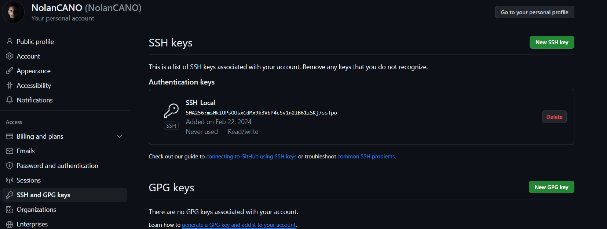

---

## 2. Tester un premier workflow Github

#### J'ai suivi le tuto sur https://docs.github.com/fr/actions/quickstart et j'ai créer mon premier workflow :

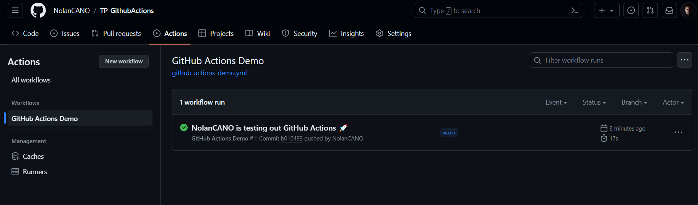

---

## 3. Créer deux classes python

#### Pour l'exo 3, j'ai du créer 2 classes python, une qui s'appelle SimpleMath.py et l'autre TestSimpleMath.py :

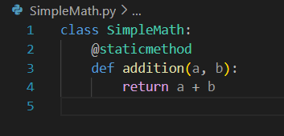

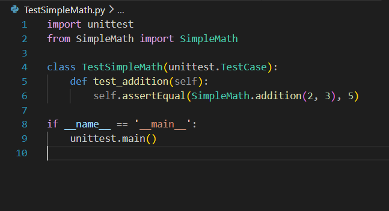

#### ensuite j'ai tester les deux fichiers avec la commande suivante :

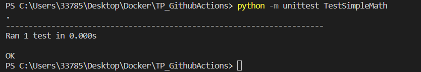

---

## 4.  créer un workflow pour lancer les tests

#### Pour tester les fichiers python, j'ai créer un workflow adapté :

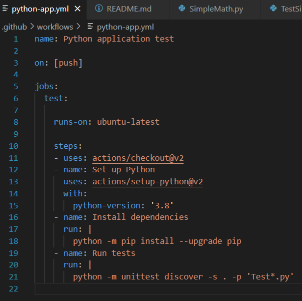

#### Après avoir push, GitHub détectera le fichier de workflow et exécutera les actions définies sur la branche main : 

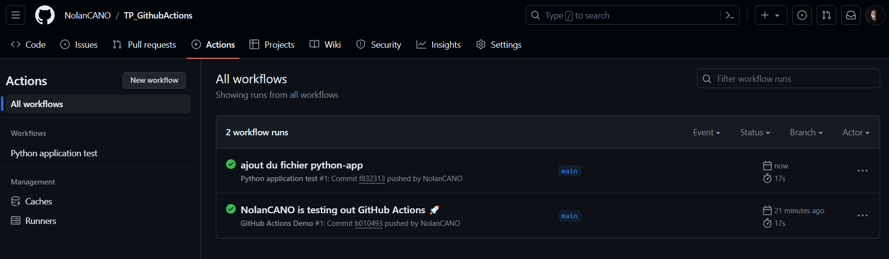

---

## 5. Créer la fonction soustraction

#### Pour cette exercice j'ai modifier mes fichiers python pour ajouter la fonction "soustraction" et son test associé :

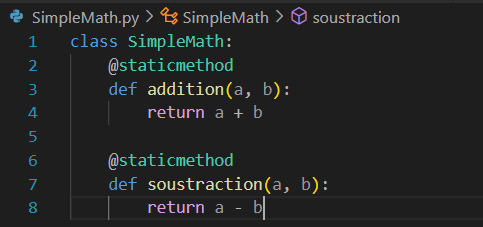

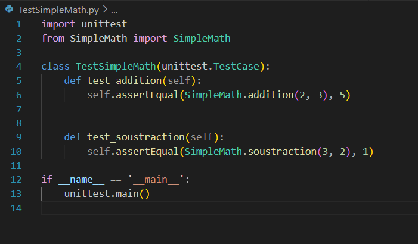

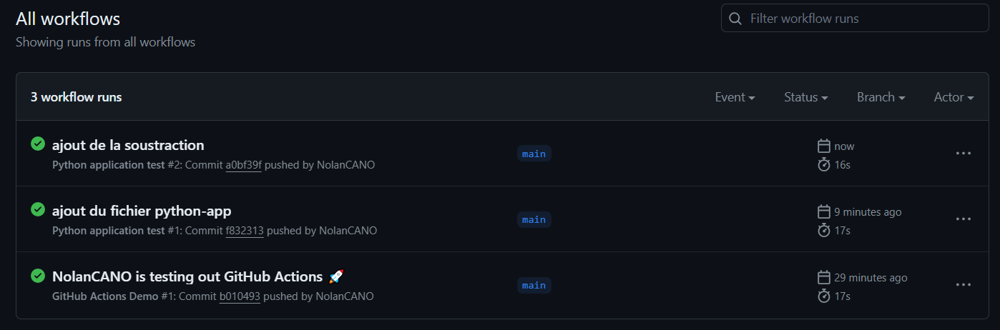

#### On peut voir ci-dessous que les tests sont bien passé après avoir push :

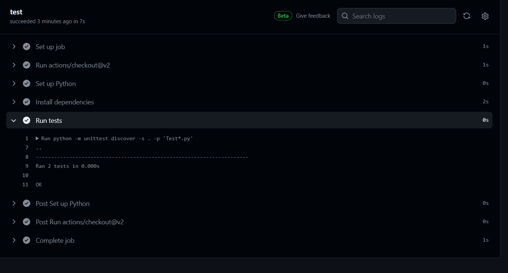

---

## 6. Ajouter et utiliser pylint

#### Pour commencer, j'ai rajouter des lignes dans mon fichier python-app.yml pour utiliser pylint :

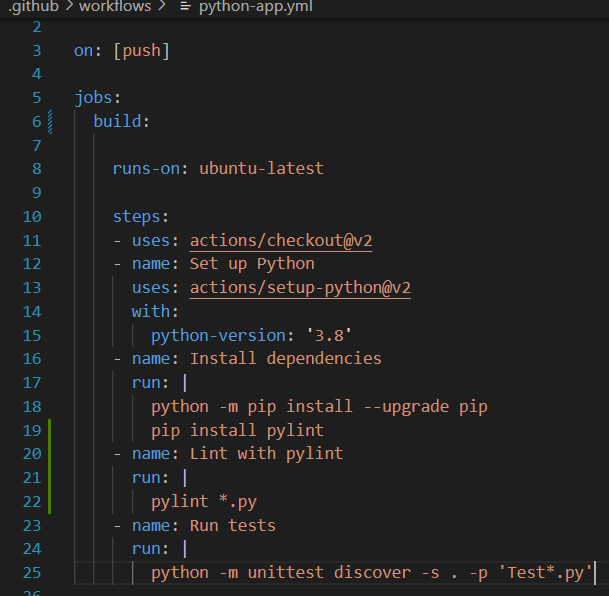

#### Ensuite, après avoir push, j'ai obtenue un score de 0.71/10

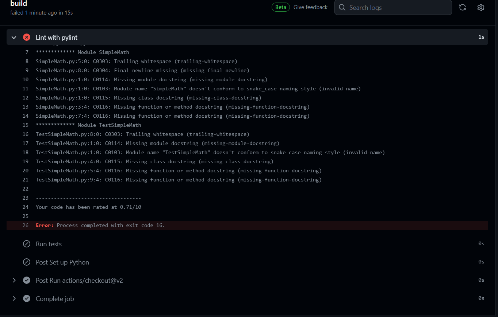

#### J'ai donc essayer d'améliorer ma note en ajoutant des commentaires et en changeant le nom de mes fichier.
#### Et j'ai obtenue la note de 3.57/10 :

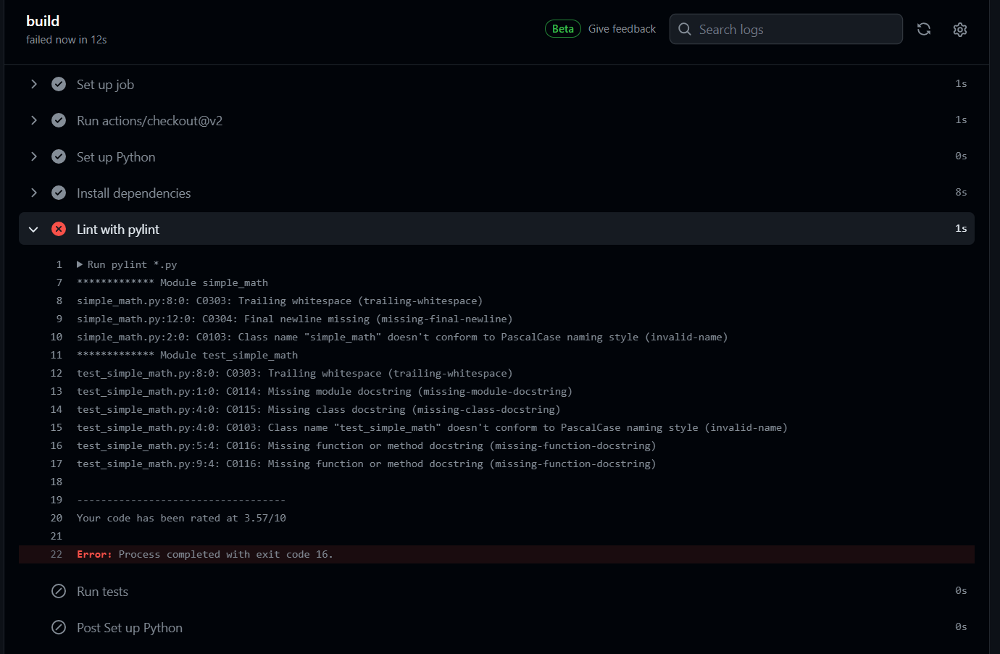

---

## 7. Ajouter une étape

#### Pour ajouter une étape qui build un conteneur Docker embarquant mon application, j’ai du modifier mon fichier python-app.yml. 
#### J’ai également décider de supprimer pylint pour cette exercice car il est trop exigent :

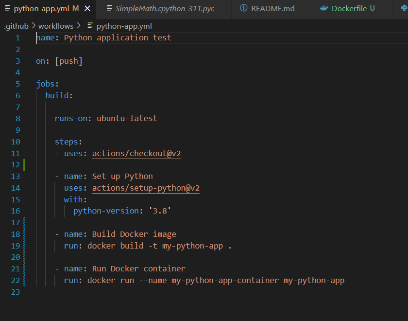

#### J'ai ensuite fait un Dockerfile qui va exécuter les tests unitaires dès le run :

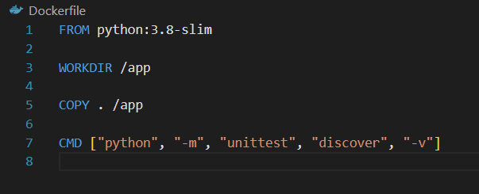

#### et pour finir j'ai push et j'ai vérifier que tout a fonctionné :

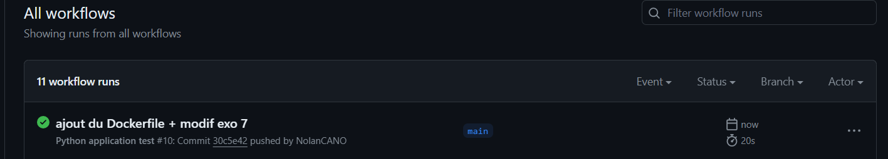

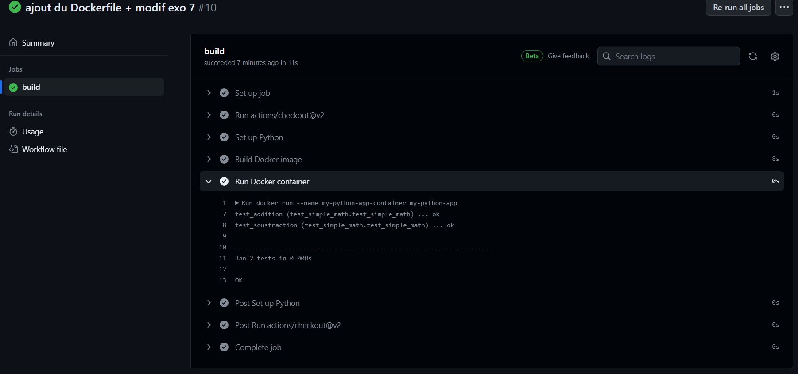

----

by Nolan CANO