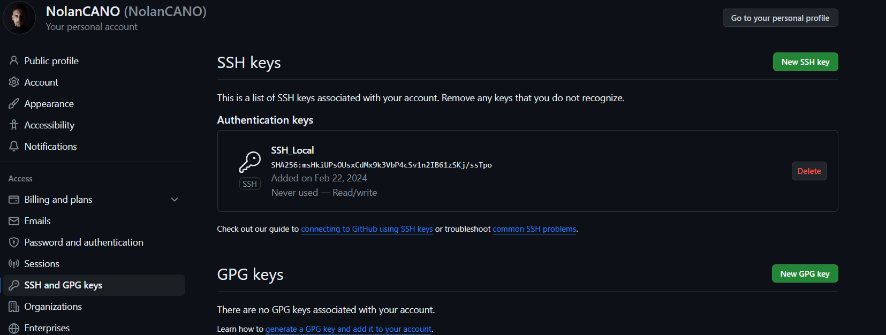
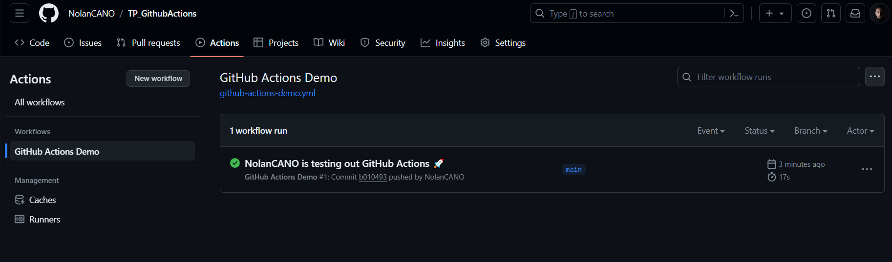
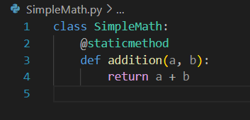
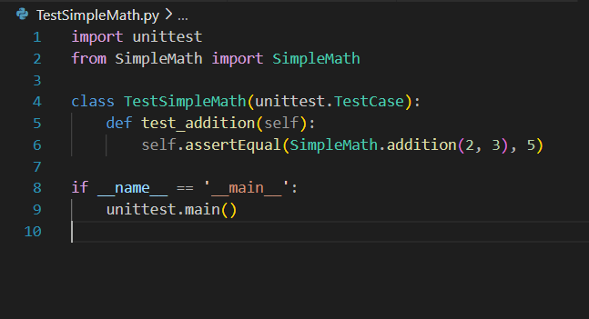
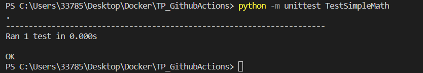
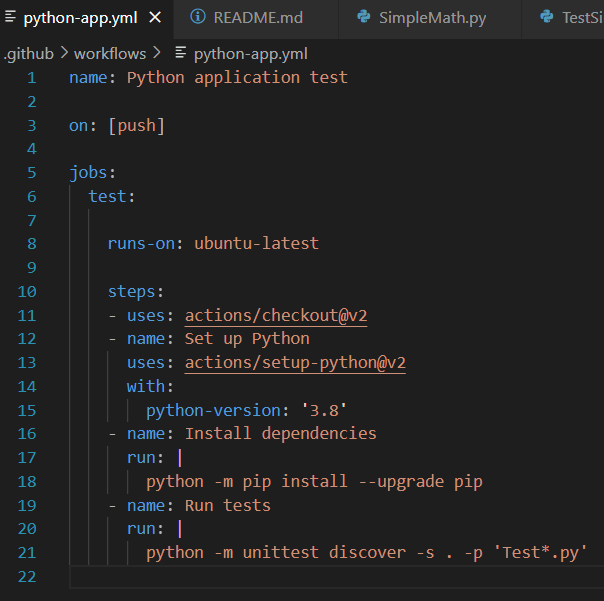

# TP_GithubActions

## 1. Lié le compte via une clé SSH

#### Pour commencer, j'ai lié mon compte Github à mon ordinateur via une clé SSH

## 2. Tester un premier workflow Github

#### J'ai suivi le tuto sur https://docs.github.com/fr/actions/quickstart et j'ai créer mon premier workflow :

## 3. Créer deux classes python

#### Pour l'exo 3, j'ai du créer 2 classes python, une qui s'appelle SimpleMath.py et l'autre TestSimpleMath.py :

#### ensuite j'ai tester les deux fichiers avec la commande suivante :

## 4.  créer un workflow pour lancer les tests

#### Pour tester les fichiers python, j'ai créer un workflow adapté :

